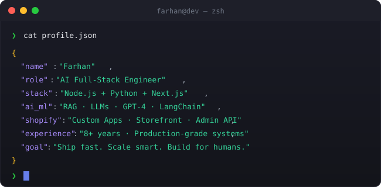

<!-- 
╔══════════════════════════════════════════════════════════════════════════════╗
║                                                                              ║
║        ███████╗ █████╗ ██████╗ ██╗  ██╗ █████╗ ███╗   ██╗                   ║
║        ██╔════╝██╔══██╗██╔══██╗██║  ██║██╔══██╗████╗  ██║                   ║
║        █████╗  ███████║██████╔╝███████║███████║██╔██╗ ██║                   ║
║        ██╔══╝  ██╔══██║██╔══██╗██╔══██║██╔══██║██║╚██╗██║                   ║
║        ██║     ██║  ██║██║  ██║██║  ██║██║  ██║██║ ╚████║                   ║
║        ╚═╝     ╚═╝  ╚═╝╚═╝  ╚═╝╚═╝  ╚═╝╚═╝  ╚═╝╚═╝  ╚═══╝                   ║
║                                                                              ║
║         🚀 FULL-STACK ENGINEER • AI/LLM DEVELOPER • CLOUD ARCHITECT 🚀      ║
║                                                                              ║
╚══════════════════════════════════════════════════════════════════════════════╝
-->

<div align="center">

  

<br/>

<div align="center">
  
</div>

<br/>


<br/>

<!-- ═══════════════════════════════════════════════════════════════════════════ -->
<!-- 👤 ABOUT ME SECTION                                                          -->
<!-- ═══════════════════════════════════════════════════════════════════════════ -->

### 🙂 About Me

</div>

<br/><br/>

```yaml
name:                  Farhan
title:                 AI Full-Stack Engineer
years_of_experience:   8+
current_status:        Building AI-powered products & Shopify apps

primary_stack:
  backend:             🟢 Node.js / Express.js
  ai_automation:       🐍 Python / FastAPI
  frontend:            ⚛️  Next.js / React.js

expertise:
  ai_ml:               🤖 RAG, LLMs, GPT-4, LangChain, embeddings
  fullstack:           🌐 Node.js + Python + Next.js end-to-end
  shopify:             🛍️  Custom apps, Polaris, Storefront & Admin API
  cloud:               ☁️  AWS, Azure, GCP

currently_building:
  - AI-powered full-stack SaaS products
  - Shopify apps with AI & automation capabilities
  - LLM pipelines integrated into production web apps

quick_facts:
  experience:          8+ years full-stack · AI/ML primary focus
  shopify:             App development & ecosystem expert
  power_stack:         Node.js + Python + Next.js
  fuel:                ☕ Coffee & shipping production AI

philosophy:            "Full-stack from model to UI. Ship fast. Scale smart."
```

<br/>

<div align="center">


<br/>

<!-- ═══════════════════════════════════════════════════════════════════════════ -->
<!-- ⚡ TECH STACK                                                               -->
<!-- ═══════════════════════════════════════════════════════════════════════════ -->

### </> Tech Stack

<br/><br/>

<div align="center">

<!-- 💻 LANGUAGES -->
<h4>💻 Languages</h4>
<p>
  <a href="https://nodejs.org/" target="_blank"></a>
  <a href="https://www.python.org/" target="_blank"></a>
  <a href="https://developer.mozilla.org/en-US/docs/Web/JavaScript" target="_blank"></a>
  <a href="https://www.typescriptlang.org/" target="_blank"></a>
  <a href="https://www.gnu.org/software/bash/" target="_blank"></a>
</p>

<!-- 🤖 AI, ML & LLM DEVELOPMENT -->
<h4>🤖 AI, ML & LLM Development</h4>
<p>
  <a href="https://openai.com/" target="_blank"></a>
  &nbsp;<a href="https://www.langchain.com/" target="_blank"></a>
  &nbsp;<a href="https://www.pinecone.io/" target="_blank"></a>
  &nbsp;<a href="https://github.com/pgvector/pgvector" target="_blank"></a>
  &nbsp;<a href="https://www.tensorflow.org/" target="_blank"></a>
  &nbsp;<a href="https://pytorch.org/" target="_blank"></a>
  &nbsp;<a href="https://scikit-learn.org/" target="_blank"></a>
</p>

<!-- 🌐 WEB & SHOPIFY DEVELOPMENT -->
<h4>🌐 Web & Shopify Development</h4>
<p>
  <a href="https://nextjs.org/" target="_blank"></a>
  <a href="https://reactjs.org/" target="_blank"></a>
  <a href="https://expressjs.com/" target="_blank"></a>
  <a href="https://www.shopify.com/partners/app-development" target="_blank"></a>
  <a href="https://vuejs.org/" target="_blank"></a>
  <a href="https://reactnative.dev/" target="_blank"></a>
  <a href="https://tailwindcss.com/" target="_blank"></a>
  <a href="https://developer.mozilla.org/en-US/docs/Web/HTML" target="_blank"></a>
  <a href="https://developer.mozilla.org/en-US/docs/Web/CSS" target="_blank"></a>
</p>

<!-- 🗄️ DATABASES -->
<h4>🗄️ Databases</h4>
<p>
  <a href="https://www.mongodb.com/" target="_blank"></a>
  <a href="https://www.postgresql.org/" target="_blank"></a>
  <a href="https://www.mysql.com/" target="_blank"></a>
  <a href="https://redis.io/" target="_blank"></a>
  <a href="https://firebase.google.com/" target="_blank"></a>
  <a href="https://www.sqlite.org/" target="_blank"></a>
</p>

<!-- 🔧 TOOLS & PLATFORMS -->
<h4>🔧 Tools & Cloud Platforms</h4>
<p>
  <a href="https://aws.amazon.com/" target="_blank"></a>
  <a href="https://azure.microsoft.com/" target="_blank"></a>
  <a href="https://cloud.google.com/" target="_blank"></a>
  <a href="https://www.docker.com/" target="_blank"></a>
  <a href="https://kubernetes.io/" target="_blank"></a>
  <a href="https://git-scm.com/" target="_blank"></a>
  <a href="https://www.linux.org/" target="_blank"></a>
  <a href="https://code.visualstudio.com/" target="_blank"></a>
  <a href="https://www.postman.com/" target="_blank"></a>
</p>

</div>

<br/>


<br/>

<!-- ═══════════════════════════════════════════════════════════════════════════ -->
<!-- 🔥 EXPERTISING                                                              -->
<!-- ═══════════════════════════════════════════════════════════════════════════ -->

<div align="center">

### ⚡ Expertising

<br/>

<a href="https://github.com/farhan711">
  
</a>
&nbsp;
<a href="https://github.com/farhan711">
  
</a>
&nbsp;
<a href="https://github.com/farhan711">
  
</a>

</div>

<br/>


<br/>

<!-- ═══════════════════════════════════════════════════════════════════════════ -->
<!-- 🌐 CONNECT WITH ME                                                          -->
<!-- ═══════════════════════════════════════════════════════════════════════════ -->

### 👋 Available

<br/>

<div align="center">

<a href="https://github.com/farhan711" target="_blank">
  
</a>
&nbsp;
<a href="https://t.me/Ascronomous" target="_blank">
  
</a>
&nbsp;
<a href="mailto:farhan7015@gmail.com">
  
</a>

</div>

<br/>


<br/>

<!-- ═══════════════════════════════════════════════════════════════════════════ -->
<!-- 📝 END OF README                                                            -->
<!-- ═══════════════════════════════════════════════════════════════════════════ -->
